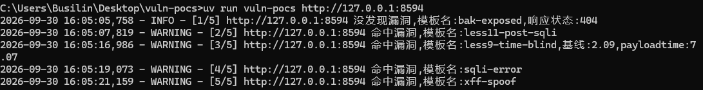
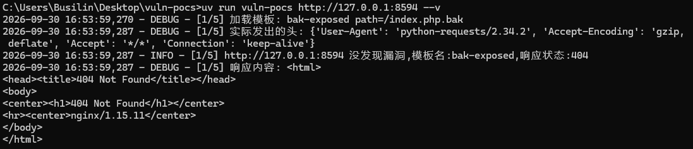

## vuln-pocs:
  vuln-pocs是基于pocs引擎的漏洞扫描器

### 快速开始

需要 Python 3.12 + uv
```bash
  uv sync                      # 装依赖
  uv run vuln-pocs <目标URL>
```
```bash
2026-09-30 20:42:33,114 - INFO - [1/5] http://127.0.0.1:8594 没发现漏洞,模板名:bak-exposed,响应状态:404
2026-09-30 20:42:35,180 - WARNING - [2/5] http://127.0.0.1:8594 命中漏洞,模板名:less11-post-sqli
2026-09-30 20:42:44,369 - WARNING - [3/5] http://127.0.0.1:8594 命中漏洞,模板名:less9-time-blind,基线:2.07,payloadtime:7.12
2026-09-30 20:42:46,467 - WARNING - [4/5] http://127.0.0.1:8594 命中漏洞,模板名:sqli-error
2026-09-30 20:42:48,570 - WARNING - [5/5] http://127.0.0.1:8594 命中漏洞,模板名:xff-spoof

```
在sqli-lab中的代码演示图



### 模式
```bash
  uv run vuln-pocs <目标URL> --v #详细输出扫描日志
```
```bash

2026-09-30 20:42:50,345 - DEBUG - [1/5] 加载模板: bak-exposed path=/index.php.bak
2026-09-30 20:42:50,350 - DEBUG - [1/5] 实际发出的头: {'User-Agent': 'python-requests/2.34.2', 'Accept-Encoding': 'gzip, deflate', 'Accept': '*/*', 'Connection': 'keep-alive'}
2026-09-30 20:42:50,350 - INFO - [1/5] http://127.0.0.1:8594 没发现漏洞,模板名:bak-exposed,响应状态:404
2026-09-30 20:42:50,352 - DEBUG - [2/5] 加载模板: less11-post-sqli path=/Less-11/
2026-09-30 20:42:52,449 - DEBUG - [2/5] 实际发出的头: {'User-Agent': 'python-requests/2.34.2', 'Accept-Encoding': 'gzip, deflate', 'Accept': '*/*', 'Connection': 'keep-alive', 'Content-Length': '37', 'Content-Type': 'application/x-www-form-urlencoded'}
2026-09-30 20:42:52,450 - WARNING - [2/5] http://127.0.0.1:8594 命中漏洞,模板名:less11-post-sqli
2026-09-30 20:42:52,451 - DEBUG - [3/5] 加载模板: less9-time-blind path=/Less-9/
2026-09-30 20:42:54,497 - DEBUG - [3/5] 实际发出的头: {'User-Agent': 'python-requests/2.34.2', 'Accept-Encoding': 'gzip, deflate', 'Accept': '*/*', 'Connection': 'keep-alive'}
2026-09-30 20:43:01,567 - WARNING - [3/5] http://127.0.0.1:8594 命中漏洞,模板名:less9-time-blind,基线:2.05,payloadtime:7.07
2026-09-30 20:43:01,569 - DEBUG - [4/5] 加载模板: sqli-error path=/Less-1/
2026-09-30 20:43:03,665 - DEBUG - [4/5] 实际发出的头: {'User-Agent': 'python-requests/2.34.2', 'Accept-Encoding': 'gzip, deflate', 'Accept': '*/*', 'Connection': 'keep-alive'}
2026-09-30 20:43:03,665 - WARNING - [4/5] http://127.0.0.1:8594 命中漏洞,模板名:sqli-error
2026-09-30 20:43:03,666 - DEBUG - [5/5] 加载模板: xff-spoof path=/Less-18/
2026-09-30 20:43:05,758 - DEBUG - [5/5] 实际发出的头: {'user-agent': 'Mozilla/5.0 (Windows NT 10.0; Win64; x64) AppleWebKit/537.36 (KHTML, like Gecko) Chrome/', 'Accept-Encoding': 'gzip, deflate', 'Accept': '*/*', 'Connection': 'keep-alive', 'X-Forwarded-For': '127.0.0.1'}
2026-09-30 20:43:05,758 - WARNING - [5/5] http://127.0.0.1:8594 命中漏洞,模板名:xff-spoof


```



*该引擎是基于yaml模板,模板请放`src/vuln_pocs/templates/`文件夹中

### 模板格式
```bash
  name: #模板名
  request:
    method: #请求方式
    path: #目录
    headers:
      #请求头(默认没有)
    param:
      #关键字:参数
    payload:
      #用去时间盲注的第二次请求
    timeout: #时间限制
  matcher:
    type: status / word / regex / size / time
    words: ["特征词"]

```
### matcher 字段

| type | 该填的字段名 | 说明 |
|---|---|---|
| `status` | `status` | 期望状态码 |
| `word` | `words` | 特征词列表，命中任一即算 |
| `regex` | `regex` | 正则列表 |
| `size` | `size` / `not_size` | 期望长度 / 排除长度 |
| `time` | `sleep` | 阈值秒数，第二发慢过它才算命中 |

### 引擎结构
```bash
  build_url #用去构造url

  load_template #导入模板

  send_request #发送请求

  match_* #用去判断漏洞类型

  render #结果输出判断
```
### 已知限制
  目前只有这一些基础功能 ,（还没做的：raw 报文模板、目标不可达处理……）
