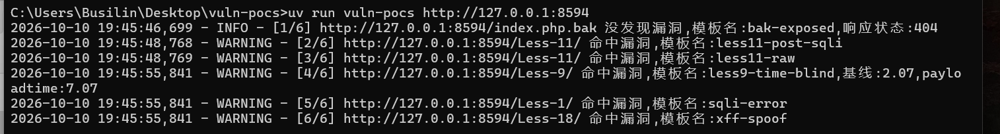
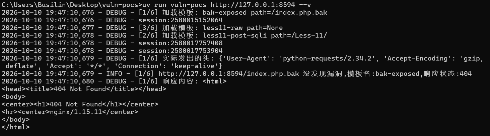

## vuln-pocs:
```bash
  vuln-pocs是基于pocs引擎的漏洞扫描器
  框架参考nuclei
```
*该引擎是基于yaml模板,模板请放`src/vuln_pocs/templates/`文件夹中
### 快速开始

需要 Python 3.12 + uv
```bash
  uv sync                      # 装依赖
  uv run vuln-pocs <目标URL>
```

在sqli-lab中的代码演示图

```bash
2026-10-10 19:45:46,699 - INFO - [1/6] http://127.0.0.1:8594/index.php.bak 没发现漏洞,模板名:bak-exposed,响应状态:404
2026-10-10 19:45:48,768 - WARNING - [2/6] http://127.0.0.1:8594/Less-11/ 命中漏洞,模板名:less11-post-sqli
2026-10-10 19:45:48,769 - WARNING - [3/6] http://127.0.0.1:8594/Less-11/ 命中漏洞,模板名:less11-raw
2026-10-10 19:45:55,841 - WARNING - [4/6] http://127.0.0.1:8594/Less-9/ 命中漏洞,模板名:less9-time-blind,基线:2.07,payloadtime:7.07
2026-10-10 19:45:55,841 - WARNING - [5/6] http://127.0.0.1:8594/Less-1/ 命中漏洞,模板名:sqli-error
2026-10-10 19:45:55,841 - WARNING - [6/6] http://127.0.0.1:8594/Less-18/ 命中漏洞,模板名:xff-spoof
```



```bash
  实测时间盲注,post型sql,未授权访问,sql注入

```

### 模式
```bash
  uv run vuln-pocs <目标URL> --v #详细输出扫描日志

```


### 功能

```bash
  1.并发:支持并发,修改 max_workers 参数
  2.raw报文解析:见下图模板格式(目前不支持多发请求,比如盲注)
  3.ast白名单:允许自己设置白名单,目前支持数字常量（int / float） · 变量名 · + · *
  4.探针:用去检查目标是否挂了,会在开始先测试一次可通性


```
### 模板格式
```bash
常规式:
  name: #模板名
  request:
    method: #请求方式
    path: #目录
    headers:
      #请求头(默认没有)
    param:
      #关键字:参数
    payload:
      #用去时间盲注的第二次请求
    timeout: #时间限制
  matcher:
    type: status / word / regex / size / time
    words: ["特征词"]
```
```bash
raw报文解析式:
  name: #模板名
  request:
   raw: |  #这个|必须要加
    #报文(注意空格.根据空格判断body)
  matcher:
    type: status / word / regex / size / time
    words: ["特征词"]
```
### matcher 字段

| type | 该填的字段名 | 说明 |
|---|---|---|
| `status` | `status` | 期望状态码 |
| `word` | `words` | 特征词列表，命中任一即算 |
| `regex` | `regex` | 正则列表 |
| `size` | `size` / `not_size` | 期望长度 / 排除长度 |
| `time` | `sleep` | 阈值秒数，第二发慢过它才算命中 |

### 引擎结构

| 函数 | 作用 | 说明 |
|---|---|---|
| `main` | 编排全流程 | CLI 参数 → 探针 → 并发派发 → 按序收集结果 |
| `probe` | 可达性探针 | 开跑前 + worker 撞连接错误时复用；绕代理，4xx/5xx 也算"活" |
| `scan_template` | 处理单个模板 | 并发单元：只算不打印，返回结果 dict |
| `load_template` | 导入 YAML 模板 | 解析失败时软跳过（不崩） |
| `raw` | 报文解析 | 首行 method + path，空行之后是 body |
| `data_check` | 模板字段校验 | 按必需字段表逐条核 |
| `build_url` | 构造 URL | 替换 `{{BaseURL}}`；相对路径则拼接 |
| `send_request` | 发送请求 | 每线程一个 Session，带超时 / 重试 |
| `replace` | `{{变量}}` 替换 | 支持嵌套 |
| `transform` | 文本转化节点 | 表达式 → 值（AST 入口） |
| `calc` | 白名单求值器 | `ast` 节点白名单，**禁用 `eval`** |
| `match_*` | 漏洞判断分派 | `status` / `word` / `regex` / `size` / `time` |
| `render` | 结果输出 | 主线程调用，保证日志顺序 |

### 已知限制
```bash
  --v 并发未做排序,只有 DEBUG 行来自各 worker、会交织
```